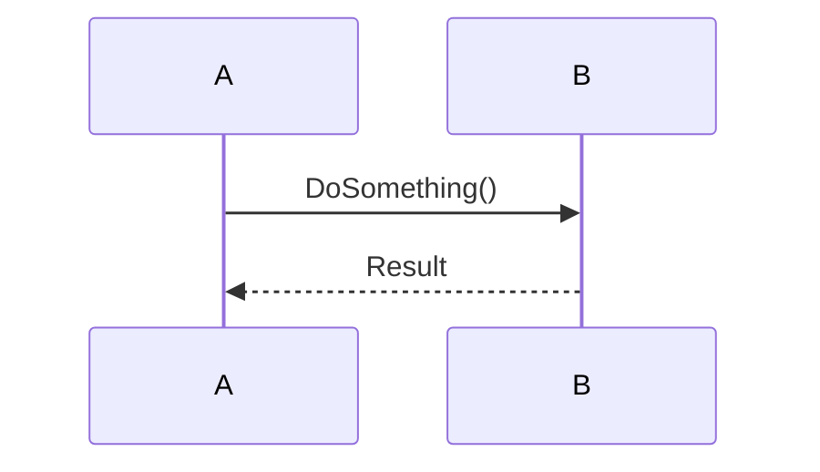
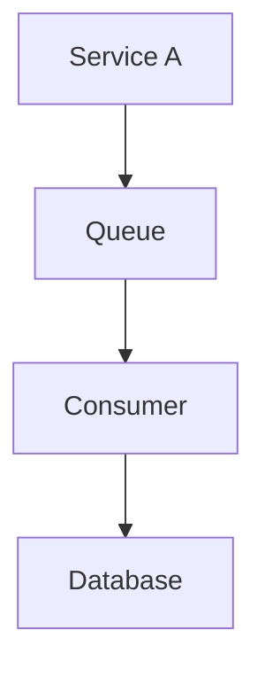

# Plan detail — Complete implementation blueprint

Take a confirmed architectural option and produce a complete, artifact-rich implementation
blueprint. This is not a high-level outline — it's everything a developer needs to start
coding without guessing: models, schemas, diagrams, API contracts, code scaffolding, and
a step-by-step implementation sequence.

**Usage:**
- `/user:plan-detail <option>` — after `/user:plan-dotnet`, referencing the confirmed option
- `/user:plan-detail <description>` — standalone, describing what to implement

## $ARGUMENTS

---

## Tone

Natural and conversational — like a senior dev walking a teammate through a whiteboard
session. Use the format that best communicates each concept: diagrams for flows and
structure, code for patterns and scaffolding, prose for reasoning. Never generate a
section just to fill space. If something doesn't apply to this specific implementation,
skip it without explanation.

For closed or binary questions, use the `AskUserQuestion` tool to render an interactive
option list instead of asking in plain text.

When the developer seems confused, don't repeat the same explanation — rephrase, use a
concrete example from the codebase, or break it into smaller pieces.

---

## Step 1 — Establish the scope

**If the conversation contains a prior plan-dotnet output:**
- Identify which option is being detailed (from $ARGUMENTS or the previously confirmed choice)
- Extract its technical description, components, and ⚠️ Crítico risks from the plan
- Note any modifications or combinations the developer specified

**If there is no prior plan:**
- Read `CLAUDE.md` and the relevant area of the codebase to understand the current state
- Treat $ARGUMENTS as the full description of what to implement

---

## Step 2 — Verify understanding before generating anything

Before producing the blueprint, make sure the scope is clear enough to be useful.
Ask only when genuinely needed — if the codebase or prior context makes the answer
obvious, state it as an explicit assumption instead.

**Scope ambiguity** — the description spans multiple components and it's unclear how much
to include.
"¿Este plan cubre solo [componente A] o también incluye [componente B]?"

**Interpretation fork** — there are two meaningfully different ways to implement this that
would produce very different blueprints. Clarify which interpretation applies before
continuing.

**Assumed infrastructure** — the description assumes something (a queue, a service, a table,
a pattern) that may or may not exist in the codebase yet.
"¿[X] ya existe en el proyecto o hay que crearlo como parte de esta implementación?"

**Option not understood** — the developer referenced an option from plan-dotnet but their
description suggests they're unclear on what that option actually does. Briefly re-explain
the core mechanism before proceeding: "Esta opción funciona así en la práctica: [explicación
en 2–3 líneas]. ¿Es eso lo que querés implementar?"

**Unknown constraints** — something about the team, timeline, or existing patterns would
significantly change the level of detail or the approach worth documenting.

Keep questions to the minimum needed. Ask everything in a single message if more than one
is required. Wait for answers before generating the blueprint.

---

## Step 3 — Explore the codebase deeply

Read every component this implementation will touch or extend:
- Existing entities, aggregates, services, repositories, and handlers in the affected domain
- Naming conventions, folder structure, and abstraction patterns already in use
- Current test structure: how unit and integration tests are organized and written
- Existing technical debt that affects the implementation path — note it explicitly
- Infrastructure already in place: messaging, caching, DB patterns, middleware

The blueprint must follow existing conventions. If introducing a new pattern, flag it.

---

## Step 4 — Generate the implementation blueprint

Produce a complete, artifact-rich plan. Use the formats and sections that this specific
implementation actually needs — not a fixed template. If a section doesn't add value here,
skip it.

### Always include

**Implementation sequence**
Ordered steps with explicit dependencies. Each step specifies:
- What to build
- Files to create or modify (exact paths)
- What it enables for the next step
- Whether it can be done independently or depends on a previous step

Number the steps. Mark blocking dependencies explicitly.

**File manifest**
| Acción | Archivo | Descripción |
|--------|---------|-------------|
| Crear | `path/to/File.cs` | ... |
| Modificar | `path/to/Existing.cs` | ... |

**Testing strategy**
- Unit tests: which classes, which behaviors, which edge cases
- Integration tests: which flows to cover end-to-end
- Critical paths to cover: happy path, failure scenarios, concurrency if relevant
- What NOT to test here and why (if relevant)

---

### Include when relevant — use the format that communicates it best

**Domain model**
When entities, aggregates, or value objects are involved. Show properties, relationships,
and invariants. Use a class diagram, a code snippet, or both — whichever is clearer.

```csharp
// Example: only the structure that matters, not full implementation
public class WebhookDispatch
{
    public WebhookDispatchId Id { get; private set; }
    public Uri Endpoint { get; private set; }
    public WebhookStatus Status { get; private set; }
    // ...
}
```

**Database schema and migrations**
When persistence changes. Show table structure, indexes, and constraints. Include the
migration class structure and flag any data migration risk.

**Sequence diagram**
When the flow involves multiple components, async operations, or the order of calls is
non-obvious. Use Mermaid.



**Component diagram**
When new infrastructure is introduced or multiple services interact. Show what connects
to what and the direction of dependencies.



**API contract**
When an endpoint is being created or modified.
- Method and route
- Request body shape with field types and validation rules
- Response shape for success and error cases
- Auth requirements

**Code scaffolding for non-obvious patterns**
When the implementation uses a pattern not already in the codebase, or when the structure
of a key class would be non-obvious from the description. Show enough to make it concrete —
not the full implementation, just the skeleton that establishes the pattern.

**Configuration and infrastructure changes**
New env vars, appsettings keys, secrets, Docker changes, or deployment configuration.
List them explicitly with their purpose and whether they're required at startup.

**Key invariants**
Things that must remain true for this implementation to work correctly — that a developer
could unknowingly break while modifying nearby code. These belong here, not in comments.

---

## Step 5 — Flag open questions and risks

If anything remains genuinely uncertain after generating the blueprint, surface it explicitly:
- Decisions deferred to implementation time that could affect the design
- Risks introduced by the approach that aren't fully mitigated by the plan
- Assumptions that should be validated before starting

---

## Step 6 — Confirm

Present a brief summary:

```
📋 Blueprint listo: [nombre de la opción / feature]

Artefactos incluidos: [diagramas / esquema de BD / scaffolding / contrato de API / etc.]
Pasos de implementación: N
Archivos a crear: N  |  Archivos a modificar: N

Supuestos asumidos:
  • [lo que se asumió sin preguntar]

Próximos pasos:
  • /user:adr-dotnet si la decisión arquitectónica aún no está documentada
  • Revisar los riesgos abiertos antes de empezar
```
